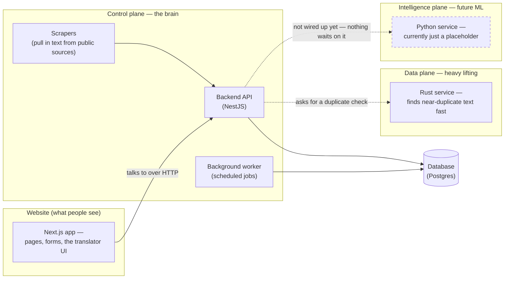
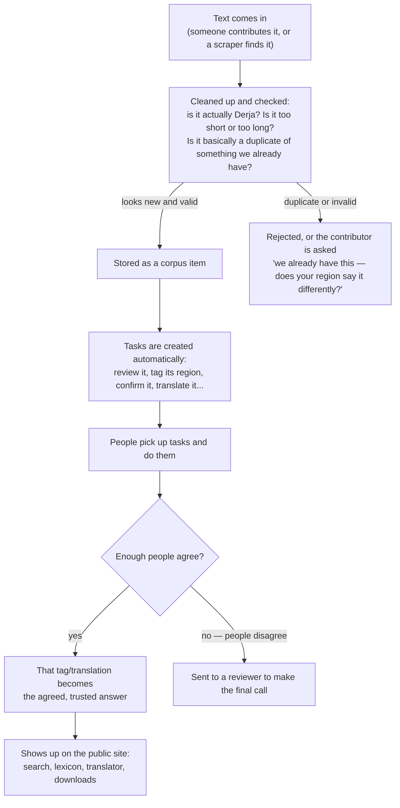
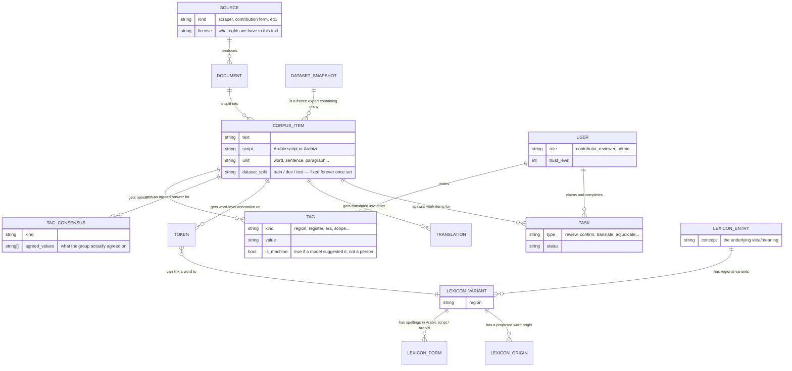

# How OpenDerja_TN is put together

This document explains how the project works, in plain language, for anyone reading it — not just
developers. If you're a developer looking for exact field names and types, the real source of truth
is [`db/schema.prisma`](../db/schema.prisma) (the database) and the code itself; this document is a
map, not a spec, and it can drift from the code over time. If something here looks wrong, that's
worth a pull request too.

## What the project actually does, in one paragraph

People visit the site and either write a sentence in their own Tunisian Derja, or do a small task —
confirm someone else's sentence, tag which region it's from, translate it, or fix its spelling. Every
one of those small actions gets checked by other people before it counts as "confirmed." Over time
this builds up a large, regionally balanced collection of real written Derja — the "corpus" — which
also powers a lexicon (a dictionary of words and their regional variants) and a translator.

## The big picture: four separate pieces

The system is split into four pieces that each do one job. Splitting it this way means each piece can
be understood, tested, and changed on its own, without having to understand everything at once.

**Why split it this way, in plain terms:**

- The **website** (`frontend/`) is the only piece a visitor ever touches directly. It doesn't talk to
  the database itself — it always goes through the backend API, so there's exactly one place that
  enforces the rules (who can do what, what counts as valid).
- The **control plane** (`control-plane/`) is where almost all the actual logic lives: checking
  logins, deciding what task to hand someone next, computing which tags a group of annotators agree
  on, pulling in new text from public sources. It's written in TypeScript and is meant to stay that
  way — most of the interesting problems here aren't about raw speed, they're about getting the rules
  right.
- The **data plane** (`data-plane/`, written in Rust) only exists for one job today: checking whether
  a new piece of text is a near-duplicate of something already in the corpus, which is a
  computation-heavy comparison that's faster in Rust than in TypeScript. Nothing else has been moved
  here — the project's rule is that a piece only gets rewritten in Rust once it's actually measured to
  be a bottleneck, not because Rust is assumed to be better.
- The **intelligence plane** (`intelligence-plane/`, Python) is reserved for future machine-learning
  work — training or running a model on the corpus once there's enough data to make that meaningful.
  Right now it's a placeholder that only answers "am I alive?" — no request from a real visitor ever
  waits on it, on purpose, so it can never be the reason the site feels slow or breaks.

## How one sentence becomes part of the corpus

This is the core loop the whole system is built around — whether the text comes from someone typing
it in directly, or from a scraper pulling it from a public source.

A few things worth knowing about this loop, explained simply:

- **Nothing one person writes is automatically "true."** A tag, a translation, a spelling
  correction — all of it stays a proposal until enough independent people agree on it, or a reviewer
  makes a final call. The "agreed answer" and "what one person suggested" are tracked as two separate
  things in the database, which is why you'll see both a `Tag` table (individual opinions) and a
  `TagConsensus` table (the resolved, agreed-on answer) — anything shown publicly reads from the
  agreed one, never from a single person's raw opinion.
- **Region is never a single choice.** Tunisian Derja isn't one dialect — it changes gradually across
  the country. So instead of picking "this text is from the North," the system always tracks a *set*
  of regions a piece of text could belong to, and keeps that honest rather than forcing a false
  either/or choice.
- **A contribution is checked for duplicates before it's stored**, the same way scraped text is —
  otherwise the corpus would slowly fill up with the same handful of sentences typed slightly
  differently.
- **Nothing gets permanently deleted**, with one deliberate exception: if someone asks for their
  personal information to be removed (their name, email, etc.), that gets scrubbed for real. The
  Derja text itself — which is the actual point of the project — stays, because removing someone's
  identity is not the same as removing their contribution to the language record.

## The database, simplified

The real database has about fifty tables — this is not that. This is the handful of tables that
matter for understanding how the pieces connect; if you need the exact columns and types, read
[`db/schema.prisma`](../db/schema.prisma) directly, and [`db/DATABASE_NOTES.md`](../db/DATABASE_NOTES.md)
for the reasoning behind the less obvious decisions.

**The two ideas that shape most of this database, in plain terms:**

1. **Annotations attach to a specific stretch of text, not a whole sentence.** Even something like
   "this whole sentence is written in a casual register" is stored as a tag covering the full text,
   rather than as a special case. This one consistent rule is what lets the system show *exactly*
   which word or phrase a tag is about, instead of a vague "somewhere in here."
2. **Every task and every annotation has enough information attached to it that redoing it twice by
   accident is impossible.** Concretely: a task carries a fingerprint built from what it's about, what
   kind of task it is, and — where it matters — *which specific piece* of the text it's about, so that
   two people can genuinely work on two different spans of the same sentence at the same time without
   the system quietly merging their work into one.

## Where to go next

- [`README.md`](../README.md) — what's built, what's a stub, and how to run the project locally.
- [`CONTRIBUTING.md`](../CONTRIBUTING.md) — how to actually send a change.
- [`API_REFERENCE.md`](API_REFERENCE.md) — every backend endpoint, what it expects, and what it
  returns, written for whoever is building the frontend against it.
- [`db/DATABASE_NOTES.md`](../db/DATABASE_NOTES.md) — the database decisions that aren't obvious just
  from reading the schema.
- [`Documentation/proposal docs/OpenDerja_TN_technical_ledger.pdf`](../Documentation/proposal%20docs/OpenDerja_TN_technical_ledger.pdf) —
  the full original reasoning behind the project: the threat model, every planned page, every task
  type, and the phases the project is meant to grow through. This document is a summary of that one,
  not a replacement for it.
